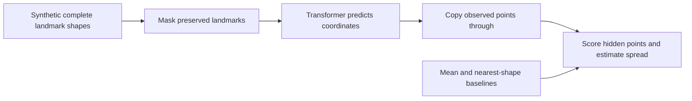

# Demonstration pipeline

```mermaid
flowchart LR
    A["Synthetic complete landmark shapes"] --> B["Mask preserved landmarks"]
    B --> C["Transformer predicts coordinates"]
    C --> D["Copy observed points through"]
    D --> E["Score hidden points and estimate spread"]
    F["Mean and nearest-shape baselines"] --> E
```

The real-data path remains a research plan: harmonized specimen landmarks and explicit validation splits would be needed before assessing fossil use.
